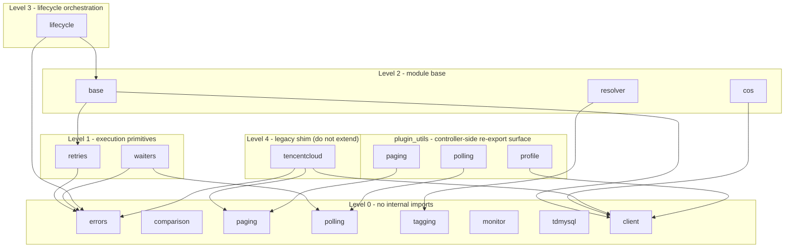

# module_utils layout and dependency direction

`plugins/module_utils/` holds every shared helper behind the collection's
modules: 15 files, ~2,400 lines. It is the single home for logic shared by
the ~440 write modules and the module generator, so keeping the boundaries
explicit matters more here than in any other directory — a helper with
unclear ownership gets duplicated by the next generated module, and an
upward import silently couples two layers.

`module_utils` is the bottom of the stack: a module may import from here and
from nowhere else in the collection. [`plugins/plugin_utils/`](../plugin_utils/README.md)
sits *above* this directory, not below it — it re-exports the names
controller-side plugins need, and the implementations stay here. That
direction is not a style choice: ansible-test's `import` test permits
module-side code to import only `plugins.module_utils`, so a helper any
module needs cannot live in `plugin_utils`.

## Grouping by responsibility

| Group | Files | Responsibility | Internal dependencies |
| --- | --- | --- | --- |
| **1 · Module base** | `base.py` | `TencentCloudModule`: shared argument spec (retry / waiter / tag params), check-mode and exit scaffolding every write module inherits | `client`, `retries` |
| | `client.py` | Tencent Cloud SDK 3.0 client factory: credential resolution, region normalization, endpoint override, TCCLI profile reading | — |
| | `tencentcloud.py` | **Legacy shim** re-exporting `client` / `errors` / `paging` for pre-refactor modules; new code must not import it | `client`, `errors`, `paging` |
| **2 · Error and lifecycle semantics** | `errors.py` | Exception hierarchy (auth / not-found / timeout / parameter failures) | — |
| | `retries.py` | `retry_on` decorator: exponential backoff with jitter for transient SDK failures | `errors` |
| | `waiters.py` | Poll loops that block until a resource reaches a desired state | `errors`, `polling` |
| | `polling.py` | The bare bounded poll loop (`poll_until` / `PollOutcome`), shared with the `tc_wait` action plugin | — |
| | `lifecycle.py` | `state: present/absent` state machine: compare → apply → wait, shared teardown ordering | `base`, `errors` |
| **3 · Resolution and comparison** | `resolver.py` | Uniform resource-reference resolution (name / id / filters → real resource id) | `tagging` |
| | `tagging.py` | Tag normalization and tag-diff computation | — |
| | `comparison.py` | Expected-vs-actual structure comparison (idempotency decisions) | — |
| | `paging.py` | `Paginator` (offset/limit walk) plus the `paginate()` module wrapper | — |
| **4 · Product-private helpers** | `monitor.py` | Monitor-specific shared computation | — |
| | `cos.py` | COS client wrapper (S3-style API, not API 3.0) | `client` |
| | `tdmysql.py` | TDSQL MySQL-specific shared logic | — |

## Dependency direction

Edges below are the actual intra-directory imports (verified 2026-09-10).
Dependencies only point "up" from a lower to a higher level; a lower level
must never import a higher one. `plugin_utils` is drawn as a consumer
because that is the only direction allowed.

Same graph as a flat table:

| File | Imports (intra-collection) | Level |
| --- | --- | --- |
| `errors.py` | — | 0 |
| `comparison.py` | — | 0 |
| `paging.py` | — | 0 |
| `polling.py` | — | 0 |
| `tagging.py` | — | 0 |
| `monitor.py` | — | 0 |
| `tdmysql.py` | — | 0 |
| `client.py` | — | 0 |
| `retries.py` | `errors` | 1 |
| `waiters.py` | `errors`, `polling` | 1 |
| `base.py` | `client`, `retries` | 2 |
| `resolver.py` | `tagging` | 2 |
| `cos.py` | `client` | 2 |
| `lifecycle.py` | `base`, `errors` | 3 |
| `tencentcloud.py` | `client`, `errors`, `paging` | 4 (shim) |
| `plugin_utils/profile.py` | `module_utils.client` | consumer |
| `plugin_utils/paging.py` | `module_utils.paging` | consumer |
| `plugin_utils/polling.py` | `module_utils.polling` | consumer |

## Rules for new helpers

1. **Dependency direction is enforced by review, not by tooling**: an import
   from a lower level into a higher one (e.g. `errors.py` importing
   `base.py`) breaks the layering and must be rejected. The one direction the
   tooling *does* enforce is the collection boundary:
   `ansible-test sanity --test import` fails if anything under
   `module_utils/` (or any module) imports `plugin_utils`.
2. **Placement is decided by responsibility, not by the calling product**:
   auth / region / client construction / profile reading goes to `client.py`;
   exception types to `errors.py`; backoff to `retries.py`; state polling to
   `waiters.py`, over the bare loop in `polling.py`; idempotency comparison to
   `comparison.py`; tag diffing to `tagging.py`; pagination to `paging.py`.
   Product-specific logic that no other product will reuse goes to group 4
   (`monitor.py` / `cos.py` / `tdmysql.py`) or, better, stays inside the
   module.
3. **Never import the legacy shim** (`tencentcloud.py`) from new code — use
   `base.py` / `client.py` directly. The shim exists only so pre-refactor
   modules keep working and is deleted once nothing imports it.
4. **Generated modules import module_utils by full FQCN**, e.g.
   `from ansible_collections.susunola.tencentcloud.plugins.module_utils.base import TencentCloudModule`.
5. **Every new file needs a module docstring** stating its group and its
   intra-directory dependencies, so the direction map above stays auditable
   by diff review.
6. **A helper with no `AnsibleModule` dependency still belongs here** if a
   module needs it — `polling.py` is the worked example. Put the
   implementation here, add a one-line re-export to
   `plugins/plugin_utils/` when a controller-side plugin needs the same
   import path, and do not re-export module globals: a re-exported constant is
   a separate binding, so rebinding it through the shim would silently do
   nothing. See [`plugins/plugin_utils/README.md`](../plugin_utils/README.md)
   for the boundary test and the two shim tests that pin it.
