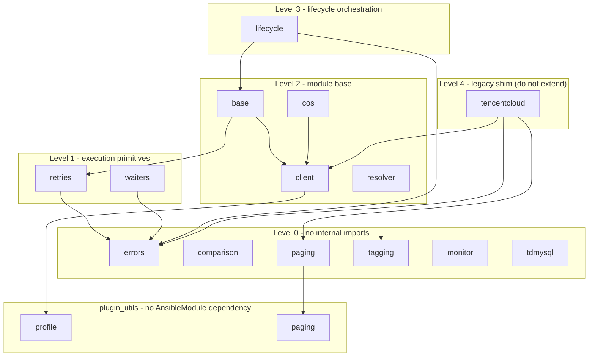

# module_utils layout and dependency direction

`plugins/module_utils/` holds every shared helper behind the collection's
modules: 14 files, ~2,300 lines. It is the single home for logic shared by
the ~440 write modules and the module generator, so keeping the boundaries
explicit matters more here than in any other directory — a helper with
unclear ownership gets duplicated by the next generated module, and an
upward import silently couples two layers.

`module_utils` is not the bottom of the stack. Helpers with no `AnsibleModule`
dependency — the ones a lookup, inventory or connection plugin can import
unchanged — live one layer down in [`plugins/plugin_utils/`](../plugin_utils/README.md),
and `module_utils` re-exports the names that existing module imports depend on.

## Grouping by responsibility

| Group | Files | Responsibility | Internal dependencies |
| --- | --- | --- | --- |
| **1 · Module base** | `base.py` | `TencentCloudModule`: shared argument spec (retry / waiter / tag params), check-mode and exit scaffolding every write module inherits | `client`, `retries` |
| | `client.py` | Tencent Cloud SDK 3.0 client factory: credential resolution, region normalization, endpoint override | — |
| | `tencentcloud.py` | **Legacy shim** re-exporting `client` / `errors` / `paging` for pre-refactor modules; new code must not import it | `client`, `errors`, `paging` |
| **2 · Error and lifecycle semantics** | `errors.py` | Exception hierarchy (auth / not-found / timeout / parameter failures) | — |
| | `retries.py` | `retry_on` decorator: exponential backoff with jitter for transient SDK failures | `errors` |
| | `waiters.py` | Poll loops that block until a resource reaches a desired state | `errors` |
| | `lifecycle.py` | `state: present/absent` state machine: compare → apply → wait, shared teardown ordering | `base`, `errors` |
| **3 · Resolution and comparison** | `resolver.py` | Uniform resource-reference resolution (name / id / filters → real resource id) | `tagging` |
| | `tagging.py` | Tag normalization and tag-diff computation | — |
| | `comparison.py` | Expected-vs-actual structure comparison (idempotency decisions) | — |
| | `paging.py` | `paginate()` module wrapper, plus a re-export of `Paginator` for the generated `_info` modules | `plugin_utils.paging` |
| **4 · Product-private helpers** | `monitor.py` | Monitor-specific shared computation | — |
| | `cos.py` | COS client wrapper (S3-style API, not API 3.0) | `client` |
| | `tdmysql.py` | TDSQL MySQL-specific shared logic | — |

## Dependency direction

Edges below are the actual intra-directory imports (verified 2026-09-08).
Dependencies only point "up" from a lower to a higher level; a lower level
must never import a higher one.

Same graph as a flat table:

| File | Imports (intra-collection) | Level |
| --- | --- | --- |
| `plugin_utils/profile.py` | — | -1 |
| `plugin_utils/paging.py` | — | -1 |
| `errors.py` | — | 0 |
| `comparison.py` | — | 0 |
| `tagging.py` | — | 0 |
| `monitor.py` | — | 0 |
| `tdmysql.py` | — | 0 |
| `retries.py` | `errors` | 1 |
| `waiters.py` | `errors` | 1 |
| `base.py` | `client`, `retries` | 2 |
| `resolver.py` | `tagging` | 2 |
| `cos.py` | `client` | 2 |
| `client.py` | `plugin_utils.profile` | 2 |
| `paging.py` | `plugin_utils.paging` | 2 |
| `lifecycle.py` | `base`, `errors` | 3 |
| `tencentcloud.py` | `client`, `errors`, `paging` | 4 (shim) |

## Rules for new helpers

1. **Dependency direction is enforced by review, not by tooling**: an import
   from a lower level into a higher one (e.g. `errors.py` importing
   `base.py`) breaks the layering and must be rejected.
2. **Placement is decided by responsibility, not by the calling product**:
   auth / region / client construction goes to `client.py`; exception types
   to `errors.py`; backoff / polling to `retries.py` / `waiters.py`;
   idempotency comparison to `comparison.py`; tag diffing to `tagging.py`;
   pagination to `paging.py`. Product-specific logic that no other product
   will reuse goes to group 4 (`monitor.py` / `cos.py` / `tdmysql.py`) or,
   better, stays inside the module.
3. **Never import the legacy shim** (`tencentcloud.py`) from new code — use
   `base.py` / `client.py` directly. The shim exists only so pre-refactor
   modules keep working and is deleted once nothing imports it.
4. **Generated modules import module_utils by full FQCN**, e.g.
   `from ansible_collections.susunola.tencentcloud.plugins.module_utils.base import TencentCloudModule`.
5. **Every new file needs a module docstring** stating its group and its
   intra-directory dependencies, so the direction map above stays auditable
   by diff review.
6. **A helper with no `AnsibleModule` dependency does not belong here.** If a
   lookup, inventory or connection plugin can use it unchanged, it goes to
   `plugins/plugin_utils/` and is re-exported from here only if an existing
   module import path must keep resolving. See
   [`plugins/plugin_utils/README.md`](../plugin_utils/README.md) for the
   boundary test.
