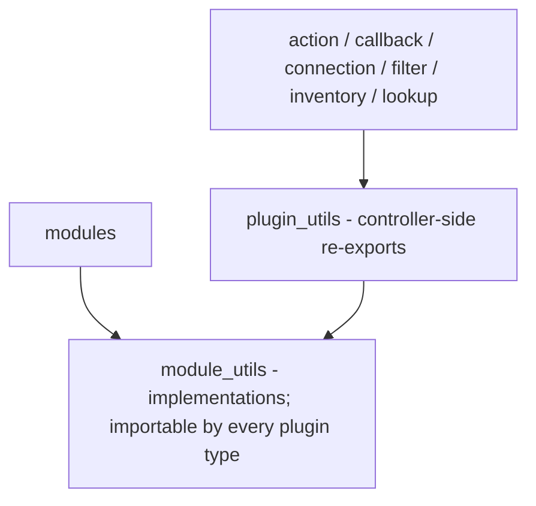

# plugin_utils layout and boundary with module_utils

`plugins/plugin_utils/` is the import surface for helpers shared by
**non-module** plugins (action, callback, connection, filter, inventory,
lookup). Its files are re-exports: the implementations live in
`plugins/module_utils/`, and this directory gives the controller-side plugins
one stable, uniform path to them.

## Why the implementation is not here

ansible-test's `import` sanity test decides what module-side code may import.
For a module or a `module_utils` file it installs a restricted loader that
allows exactly two collection namespaces:

```
ansible_collections.*.*.plugins.module_utils
```

(`ansible-test/_util/target/sanity/import/importer.py`, the
`ansible_collections...plugins.module_utils` namespace entry). Anything else
in the collection — including `plugins.plugin_utils` — raises
`ImportError: import of "..." is not allowed in this context`.

So the constraint is one-directional and enforced:

* **modules and `module_utils` may not import `plugin_utils`** — a helper a
  module needs has to be implemented in `module_utils`;
* **non-module plugins may import either** — the loader is unrestricted for
  them, so importing `plugin_utils` (or `module_utils` directly) both work.

`plugin_utils` is therefore not the layer *below* `module_utils`; it is the
layer *above* it that only controller-side plugins reach. Putting an
implementation here and re-exporting it from `module_utils` fails sanity with
one error per module (881 of them the first time it was tried).

## Current files

| File | Re-exports | Consumers today |
| --- | --- | --- |
| `profile.py` | `load_profile` from `module_utils.client` | the `resource_id` / `ssm_parameter` / `sts_caller_identity` lookups, the CVM / CLB / COS / SG / TKE inventory plugins, the `tat` connection plugin |
| `paging.py` | `Paginator` from `module_utils.paging` | the CVM / CLB / SG / TKE inventory plugins |
| `polling.py` | `PollOutcome`, `poll_until` from `module_utils.polling` | the `tc_wait` action plugin |
| `tags.py` | `merge_tags` from `module_utils.tagging` | the `tag_merge` filter plugin |

`PROFILE_FILE` / `DEFAULT_PROFILE_NAME` are deliberately **not** re-exported:
a re-exported constant is a separate binding, so rebinding
`plugin_utils.profile.PROFILE_FILE` would silently have no effect on the
reader. Patch `module_utils.client.PROFILE_FILE` instead.

## Layering

A lower layer never imports a higher one.



## Rules for new helpers

1. **Import direction**: `plugin_utils` may import `module_utils`;
   `module_utils` may **never** import `plugin_utils`, and neither may a
   module. This one is enforced by `ansible-test sanity --test import`, so it
   cannot be argued with — run that test after any move between the two
   directories.
2. **Implement in `module_utils`, re-export here** when modules need the
   helper too (which is the common case: `load_profile` is used by
   `module_utils.client` itself, `Paginator` by every generated `_info`
   module, `poll_until` by `module_utils.waiters`). Add a file here only when
   a controller-side plugin needs it.
   The reverse case — a helper only a controller-side plugin consumes — still
   goes in `module_utils`. `merge_tags` is the worked example: its only
   consumer today is the `tag_merge` filter, but tag reading and tag
   comparison are one body of semantics, so splitting them would let
   `module_utils.tagging` and the filter drift apart, and a module that later
   needs the merge would have to move the implementation back down anyway.
3. **Every file needs a module docstring** stating its responsibility and its
   intra-collection dependencies, so the boundary stays auditable by diff.
4. **Tests live next to the implementation.** Reader tests for
   `load_profile` patch `module_utils.client.PROFILE_FILE` and live in
   `tests/unit/plugins/module_utils/`; `tests/unit/plugins/plugin_utils/`
   keeps the re-export identity assertions (`plugin_utils.profile.load_profile
   is module_utils.client.load_profile`), which are what stop the shim from
   silently drifting into a copy.
5. `ansible-test` recognises `plugin_utils` as a collection plugin directory
   (`_internal/provider/layout/__init__.py`), so nothing needs to be declared
   in `meta/extensions.yml`; that file is only for plugin types ansible-core
   does not know at all (here: `event_source`).
6. **Every `tests/` directory that holds pytest files carries an empty
   `__init__.py`.** pytest's default `prepend` import mode names a test module
   after its bare file name unless the directory is a package, so
   `module_utils/test_paging.py` and `plugin_utils/test_paging.py` would
   otherwise abort collection with "import file mismatch". The file must be
   **zero bytes**: ansible-test's `empty-init` code-smell test fails any
   non-empty `__init__.py` under `tests/unit/`. Keep the marker when you add a
   directory, and put the explanation here rather than in the file.
