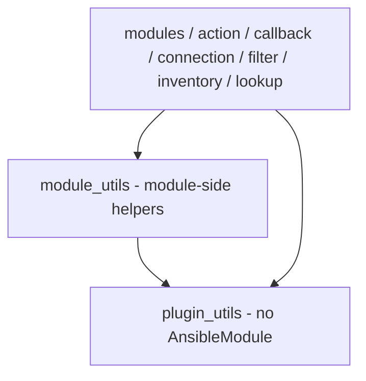

# plugin_utils layout and boundary with module_utils

`plugins/plugin_utils/` holds helpers that every plugin type may import: they
take no `AnsibleModule`, read no module argument spec, and make no assumption
that they are running inside a module payload. That is the whole point of the
directory — it is the layer *below* `module_utils`.

The split is not cosmetic. `module_utils` is documented as a support directory
for **modules**; a lookup, inventory or connection plugin importing from it
works only because the collection happens to be installed on the controller.
`plugin_utils` is the directory the collection requirements define for code
shared between plugin types, so a controller-side plugin importing from here
depends on a layer that is defined for it.

## Current files

| File | Responsibility | Consumers today |
| --- | --- | --- |
| `profile.py` | Read a TCCLI credential profile section from `~/.tencentcloud/default.configure` (explicit option > environment variable > profile is the caller's job; this file only reads the file) | `module_utils.client` (re-export), the `resource_id` / `ssm_parameter` / `sts_caller_identity` lookups, the CVM / CLB / COS / SG / TKE inventory plugins, the `tat` connection plugin |
| `paging.py` | `Paginator`: the single offset/limit list-API loop | generated `_info` modules and hand-written modules via `module_utils.paging` (re-export), the CVM / CLB / SG / TKE inventory plugins |

## Boundary

Put a helper in `plugin_utils` when **all** of the following hold:

1. it has no `AnsibleModule` dependency (no `module.params`, no
   `module.fail_json`, no `module.warn`);
2. it is not tied to the module payload (no `ansible.module_utils` imports that
   only exist inside a module, no reliance on being shipped to the target);
3. at least one non-module plugin type (action, callback, connection, filter,
   inventory, lookup) either uses it already or plausibly will.

Put it in `module_utils` when it is module-side: an `AnsibleModule` subclass,
an argument spec, an exit/fail envelope, or a lifecycle helper that reports
through a module. Product-specific computation that only one product family
needs belongs in `module_utils` (or, better, stays inside the module).

## Layering

A lower layer never imports a higher one.

`module_utils/paging.py` and `module_utils/client.py` re-export the moved
names. That is deliberate and load-bearing:

* `scripts/generate_info_modules.py` emits
  `from ...module_utils.paging import Paginator` into every generated `_info`
  module, and the generator is write-once — committed generated modules can
  never be rewritten — so that import path is frozen;
* the module-side helpers keep a stable public surface for existing module
  imports.

New code that is not a module should import from `plugin_utils` directly.

## Rules for new helpers

1. **Import direction**: `plugin_utils` imports nothing from `module_utils`;
   `module_utils` may import `plugin_utils`. Review enforces this, not tooling.
2. **Every file needs a module docstring** stating its responsibility and its
   intra-collection dependencies, so the boundary stays auditable by diff.
3. **Re-exports need a comment** saying why the old path must keep working.
4. **Tests live in `tests/unit/plugins/plugin_utils/`** and import through the
   plugin_utils path. Tests that patch module state (for example
   `profile.PROFILE_FILE`) must patch the module that reads it, not a
   re-exporting module — the re-exported name is a separate binding.
5. `ansible-test` recognises `plugin_utils` as a collection plugin directory
   (`_internal/provider/layout/__init__.py`), so nothing needs to be declared
   in `meta/extensions.yml`; that file is only for plugin types ansible-core
   does not know at all (here: `event_source`).
